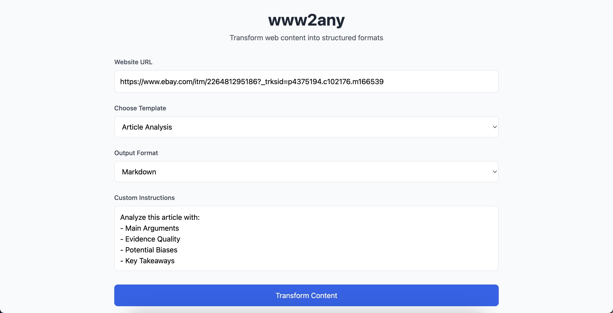
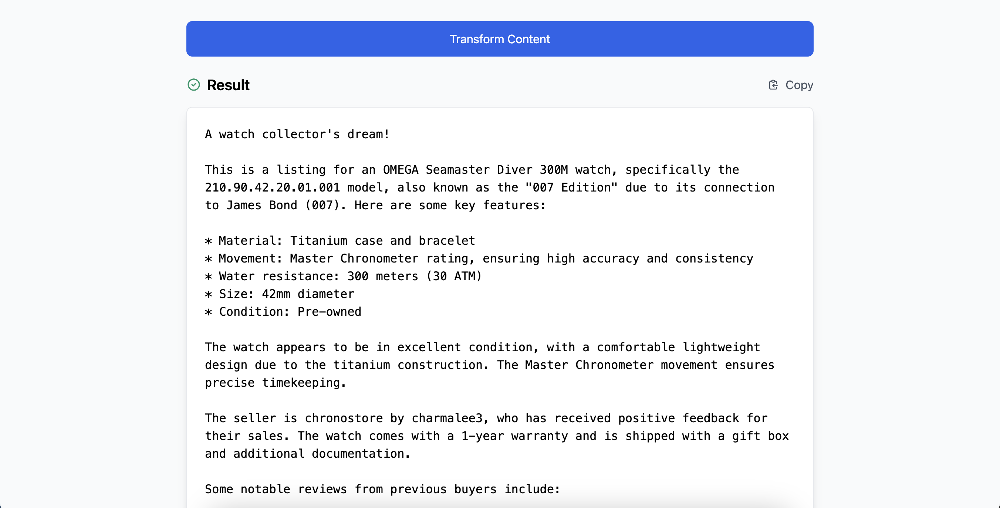

# www2any

A web application that scrapes web pages, extracts main content, and uses OpenLLaMA to convert the content into specified formats.

## Features

- Web interface for URL input and format selection
- Playwright-based web scraping
- Content extraction and HTML cleanup
- OpenLLaMA integration for content transformation
- Flask-based web server

## Installation

1. Install uv (if not already installed):
```bash
pip install uv
```

2. Clone the repository:
```bash
git clone https://github.com/arman-bd/www2any.git
cd www2any
```

3. Create a virtual environment and install dependencies using uv:
```bash
uv venv
source .venv/bin/activate  
# Windows: .venv\Scripts\activate
uv pip sync pyproject.toml
```

4. Install Playwright browsers:
```bash
playwright install
```

5. Install OpenLLaMA:

Follow the instructions in the [OpenLLaMA website](https://ollama.com/download) to install the OpenLLaMA API server.

## Development Setup

For development, install additional development dependencies:
```bash
uv pip sync --editable ".[dev]"
```

## Usage

1. Start the Flask server:
```bash
uv run www2any
```

2. Open your browser and navigate to `http://localhost:5000`

3. Enter a URL and select your desired output format

4. Click "Process" to get the transformed content

## Configuration

Create a `.env` file in the project root with the following settings:

```
OPENLLAMA_API_URL=http://localhost:8080
FLASK_ENV=development
```

## In Action

 | 

## Testing

Run tests using pytest:
```bash
uv run pytest
```

## Development

Ruff is used for code formatting, linting, and import sorting. Here are the common commands:

- Format code: `ruff format src`
- Lint and fix code: `ruff check --fix src`
- Run tests: `pytest`

### VS Code Integration

Add these settings to your `.vscode/settings.json`:

```json
{
    "editor.formatOnSave": true,
    "editor.codeActionsOnSave": {
        "source.fixAll.ruff": "explicit",
        "source.organizeImports.ruff": "explicit"
    },
    "[python]": {
        "editor.defaultFormatter": "charliermarsh.ruff"
    },
    "python.analysis.typeCheckingMode": "basic",
    "python.testing.pytestEnabled": true,
    "python.testing.unittestEnabled": false,
    "python.testing.nosetestsEnabled": false,
    "python.testing.pytestArgs": [
        "tests"
    ]
}
```

## License

MIT License